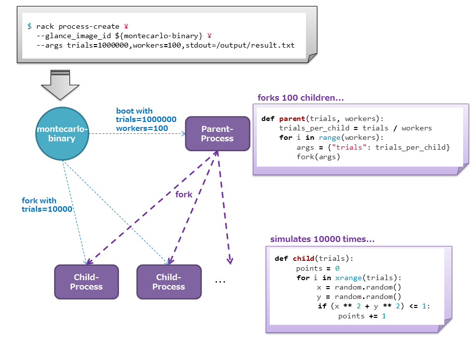
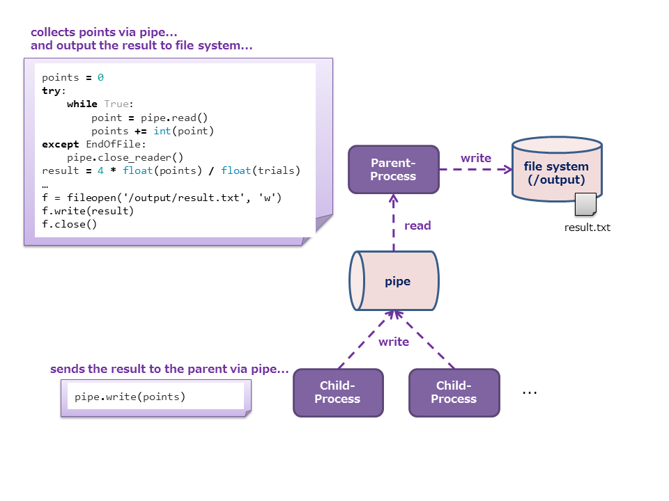

# モンテカルロ法による円周率近似値計算アプリケーション

ここではRACKを活用した分散アプリケーションプログラムの例の一つとして、モンテカルロ法を利用した円周率近似値計算アプリケーションを解説します。


## モンテカルロ法による円周率近似値計算

モンテカルロ法は乱数を利用したシミュレーションを繰り返し行うことにより近似解を求める手法です。
円周率の近似値計算についての詳しい説明は他のサイトに譲りますが、整理すると以下の式によって表現されます。

```
π = 4 × (1/4円の面積) / (正方形の面積)
```

ここで、乱数x,yを発生させ、正方形内に点P(x, y)を打つということを繰り返していくと、「1/4円内の点の数」と「正方形内の点の数」との比は、「1/4円の面積」と「正方形の面積」との比に近づいていくことになります。
したがって、円周率は以下の式によって計算されます。

```
π = 4 × (1/4円内の点の数 / 正方形内の点の数)
```


## 課題

モンテカルロ法はシミュレーションの実行回数を増やせば増やすほど精度の高い解を得られる手法ですが、高い精度を求めようとするとその分計算に時間がかかってしまいます。
これは、1台のコンピュータという限られたリソースの中でシミュレーションを行うために起こる問題です。
そこでこのシミュレーションシステムにRACKの思想を取り入れます。
システムにはシミュレーションの実行回数と、シミュレーションを行うノード数をパラメータとして与えます。
するとシステムはパラメータに基づいて自身のリソースをスケールさせ、高速にシミュレーションを行います。


## アプリケーションの動作フロー

本アプリケーションは、与えられたパラメータに基づいてforkを行う親プロセスと、シミュレーションを行う子プロセスによって構成されています。
はじめに親プロセスは、`シミュレーションの実行回数(trials)`と`シミュレーションを行うノード数(workers)`という2つのパラメータから`1ノードあたりのシミュレーション実行回数(trials_per_child)`を算出します。
次に、子プロセスを`workers`数分forkします。
このとき、子プロセスにはパラメータとして`trials_per_child`を与えます。
ここで親プロセスは子プロセスの処理が終わるのを待ちます。

子プロセスは起動すると、`trials_per_child`の回数だけシミュレーションを行い、結果を親プロセスに通知します。
ここでは通知方法として`rack-proxy`が提供する`pipe`を利用しています。

親プロセスは子プロセスから受け取った結果を集計し、最終的な解を計算します。

最後に、親プロセスはシミュレーション結果のレポートを`file system`に保存します。
`file system`は`rack-proxy`が提供しています 。





## アプリケーションの実行準備

### 1. Glanceイメージの作成

親プロセス、子プロセスは共に同じGlanceイメージから起動します。
起動時に自身に親プロセスが存在するかどうかを確認することにより、振る舞いを変えるようにしています。

まずは、HorizonもしくはNova CLIからVMを起動してください。
`CentOS-6.5`ベースのGlanceイメージを使用し、VMがDNSサーバにて名前解決できる必要があります。

VMが起動したらrootユーザでログインし、以下のコマンドを順に実行してください。
`imagebuild.sh`スクリプトは、動作に必要なパッケージのインストール、設定等を一括で行います。

```
# git clone https://github.com/stackforge/rack
# cd rack/tools/sample-apps/pi-montecarlo
# ./imagebuild.sh
Start image building...
...

****************************************
Finish image building.
Shutdown and save snapshot of this instance via Horizon or glance command.
****************************************
```

上記のメッセージが表示されたら完了です。
VMをシャットダウンし、HorizonもしくはGlance CLIで**スナップショットを作成してください**。

下記のようなメッセージが出ていたら、スクリプトは処理を完了していません。
問題を解決し、再度`imagebuild.sh`を実行してください。

```
****************************************
Error occurred. Execution aborted.
Error: Installing the required packages
****************************************
```


### 2. プロセスグループの初期化

本アプリケーションを動作させるための環境を用意します。
事前に`rack-api`が起動している必要があります。
`rack-api`の準備については[**こちら**](https://github.com/stackforge/rack/blob/master/tools/setup/README_ja.md)をご覧ください。

RACK CLIを導入したマシン上で、グループ初期化用の設定ファイルを作成します。
RACK CLIの導入方法については[**こちら**](https://github.com/stackforge/python-rackclient)をご覧ください。

以下の空欄になっている部分はご自身の環境に合わせて記載してください。

**group.conf**
```
[group]
name =

[keypair]
is_default = True

[network]
cidr =
ext_router_id =
dns_nameservers =

[securitygroup]
rules =
    protocol=tcp,port_range_max=8088,port_range_min=8088,remote_ip_prefix=0.0.0.0/0
    protocol=tcp,port_range_max=8888,port_range_min=8888,remote_ip_prefix=0.0.0.0/0
    protocol=tcp,port_range_max=8080,port_range_min=8080,remote_ip_prefix=0.0.0.0/0
    protocol=tcp,port_range_max=6379,port_range_min=6379,remote_ip_prefix=0.0.0.0/0

is_default = True

[proxy]
nova_flavor_id =
glance_image_id =
```

以下のコマンドでプロセスグループを初期化します。

```
$ export RACK_URL=http://{rack-apiVMのIPアドレス}:8088/v1
$ rack group-init group.conf
...
+------------------+--------------------------------------+
| Property         | Value                                |
+------------------+--------------------------------------+
| gid              | d5e7711b-38fb-4ae3-a3c5-3d4b88a3983d |
| keypair_id       | 4ae497df-4f41-4cc3-bb11-14f7d8fff0ef |
| network_id       | f1cff914-c9e8-4a8e-ba51-4f0481680c89 |
| proxy pid        | 8377f985-6b68-4eb5-a0c0-502cc06a4edd |
| securitygroup_id | 2e965967-2f43-4a1b-9aa2-1e9e321ecbd7 |
+------------------+--------------------------------------+
```

しばらくすると、`rack-proxy`VMが起動します。
`rack-proxy`の動作確認のため、以下のコマンドを実行してください。

```
$ rack --rack-url http://{rack-proxyVMのIPアドレス}:8088/v1 group-list
+--------------------------------------+---------+-------------+--------+
| gid                                  | name    | description | status |
+--------------------------------------+---------+-------------+--------+
| d5e7711b-38fb-4ae3-a3c5-3d4b88a3983d | test    | None        | ACTIVE |
+--------------------------------------+---------+-------------+--------+
```

これでプロセスグループの初期化は完了です。


### 3. アプリケーションの実行

アプリケーションの実行方法は非常にシンプルです。
手順1で作成したGlanceイメージに対してパラメータを指定して起動するだけです。

RACK CLIでは`--args`というオプションによってアプリケーションに任意のパラメータを指定することができます。
ここではパラメータとして`trials`と`workers`、`stdout`を指定します。
`trials`と`workers`のパラメータの意味はアプリケーションの動作フローのところで解説したとおりです。
`stdout`にはアプリケーションの実行結果の出力先を指定します。
通常のファイルシステムのようにスラッシュ区切りでパスを指定します。
ここでは`/output/result.txt`というパスを指定しています。

それでは以下のコマンドを実行し、アプリケーションを起動してください。
環境変数`RACK_GID`には先ほど作成したグループの`gid`を指定してください。

```
$ export RACK_GID=d5e7711b-38fb-4ae3-a3c5-3d4b88a3983d
$ rack process-create \
  --nova_flavor_id {任意のフレーバーID} \
  --glance_image_id {手順1で作成したGlanceイメージのID} \
  --args trials=1000000,workers=3,stdout=/output/result.txt
```

正常に処理が完了すると、すべてのプロセスは削除されます。
シミュレーションの結果は`file system`に保存されているので、
以下のコマンドでファイルを取得してください。

```
$ rack file-get --proxy_ip {rack-proxyVMのIPアドレス} /output/result.txt
$ cat result.txt
+----------+-------------------+
| Property | Value             |
+----------+-------------------+
| trials   | 1000000           |
| workers  | 3                 |
| points   | 785444            |
| pi       | 3.14159265359     |
| result   | 3.141776          |
| error    | 0.00018334641     |
| time     | 63.4065971375     |
+----------+-------------------+
```

### 4. アプリケーションの性能検証

本アプリケーションは指定するパラメータの値によって実行結果が異なります。
`trials`と`workers`を大きくしていけば、実行時間は一定に保ちつつ、より精度の高い結果が得られるでしょう。
また一方で、`trials`を固定したまま`workers`を大きくしていけば、実行時間は短くなっていくでしょう。

