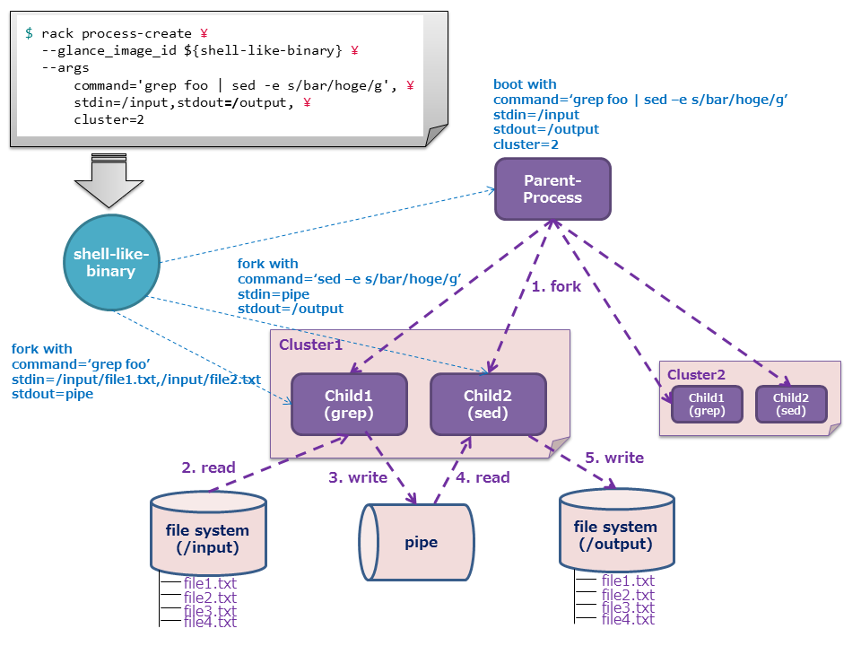

# Distributed shell-like application

In this chapter, we will discuss about one of the examples of distributed application.
This application, distributed shell-like application, processes one-liner command.
It is a unique application with RACK philosophy.

## Flow of shell execution

One-liner shell is written as a seriess of commands.

```
$ cat /input/file.txt | grep -i "foo" | sed -e "s/bar/hoge/g"
```

In this example, first a `bash` process `forks` a `cat` process, `grep` process and `sed` process, then standard input and output of each process.
Secondly, string characters output from `cat` process are sent to `grep` process via pipe, then search is conducted by `grep`.
At last, the output from `grep` process is sent to `sed` process via pipe again, then replace is conducted by `sed` and its result is output to standard output.
This series of processes is clearly executed on **ONE COMPUTER**.


## Distributed process of one-liner shell utilizing RACK

The application we created executes one-liner shell on multiple VMs in a distributed manner.
Its mechanism follows.

First, input file is saved on `filesystem` RACK provides.

Secondly, parent process(VM) is booted as a `bash` role. This parent process is provided with input directory path (e.g. '/input'), output directory path (e.g. '/output') and commands (e.g. `grep -i "foo" | sed -e "s/bar/hoge/g"`) as options.

Thirdly, parent process `fork`s child processes(VM). Each child process is assigned to execute a command,  
`grep -i "foo"` and `sed -e "s/bar/hoge/g"` respectively. Output transfer between child processes is done by pipe which RACK provides.

Lastly, child process executed `sed` command then stores result to filesysytem.


You can pass a number of clusters as an option for the parent process in order to execute multiple input files parallelly. For example, if you set the number of clusters as two, two sets of `grep` process and `sed` process will be boot. And in case you have 4 files in the input directory, each cluster processes 2 files.
More the number of clusters, higher overall throughput gets.


## Potential for a new application architecture 

With RACK, you can finished the job at high speed in a distributed manner, even a time consuming job due to the massive amount of data on a single machine.
Also, passing data from one VM to another for further processing can be easily implemented utilizing pipe capability RACK provides. You no longer have to spend time for cumbersome tasks such as finding IPs or checking peer liveliness.

RACK has the potential for a new application architecture.





## Preparing Application

### 1. Create a Glance image(snapshot)

Both parent process and child process share the same Glance image.
It changes its role by checking the existence of the parent process at boot.

First, boot the VM from Horizon or Nova CLI. Please use `CentOS-6.5` based Glance image, and make sure VM  can connect to the Internet.

Secondly after boot, login as root and execute following commands. This `imagebuild.sh` installs required packages and configure them.


```
# git clone https://github.com/stackforge/rack
# cd rack/tools/sample-apps/shell-vm
# ./imagebuild.sh
Start image building...
...

****************************************
Finish image building.
Shutdown and save snapshot of this instance via Horizon or glance command.
****************************************
```

Above message indicates installation and configuration complete. Shutdown VM and **create a snapshot** from Horizon or Glance CLI.

Following message indicates installation and configuration finished properly. Please resolve issue and run `imagebuild.sh` again.

```
****************************************
Error occurred. Execution aborted.
Error: Installing the required packages
****************************************
```


### 2. Initialize the process group

This section explains how to set up an environment for this application. `rack-api` needs to be run before proceeding this step.
For details of installation of RACK CLI, please refer to [**here**](https://github.com/stackforgehon-rackclient).

First, we will create a configuration file for process group initialization on RACK CLI installed machine.
For details of installation of RACK CLI, please refer to [**here**](https://github.com/stackforgehon-rackclient).

Please fill empty section with your environment parameters.

**group.conf**
```
[group]
name =

[keypair]
is_default = True

[network]
cidr =
ext_router_id =
dns_nameservers =

[securitygroup]
rules =
    protocol=tcp,port_range_max=8080,port_range_min=8080,remote_ip_prefix=0.0.0.0/0
    protocol=tcp,port_range_max=8088,port_range_min=8088,remote_ip_prefix=0.0.0.0/0
    protocol=tcp,port_range_max=8888,port_range_min=8888,remote_ip_prefix=0.0.0.0/0
    protocol=tcp,port_range_max=6379,port_range_min=6379,remote_ip_prefix=0.0.0.0/0

is_default = True

[proxy]
nova_flavor_id =
glance_image_id =
```

Run following commands to initialize the process group.

```
$ export RACK_URL=http://{ IP address of rack-apiVM }:8088/v1
$ rack group-init group.conf
...
+------------------+--------------------------------------+
| Property         | Value                                |
+------------------+--------------------------------------+
| gid              | d5e7711b-38fb-4ae3-a3c5-3d4b88a3983d |
| keypair_id       | 4ae497df-4f41-4cc3-bb11-14f7d8fff0ef |
| network_id       | f1cff914-c9e8-4a8e-ba51-4f0481680c89 |
| proxy pid        | 8377f985-6b68-4eb5-a0c0-502cc06a4edd |
| securitygroup_id | 2e965967-2f43-4a1b-9aa2-1e9e321ecbd7 |
+------------------+--------------------------------------+
```

You will see `rack-proxy` VM boots. Please check `rack-proxy` works properly by running the following commands.

```
$ rack --rack-url http://{ IP address of rack-proxyVM }:8088/v1 group-list
+--------------------------------------+---------+-------------+--------+
| gid                                  | name    | description | status |
+--------------------------------------+---------+-------------+--------+
| d5e7711b-38fb-4ae3-a3c5-3d4b88a3983d | test    | None        | ACTIVE |
+--------------------------------------+---------+-------------+--------+
```

This completes initialization of a process group.


### 3. Run the application

#### 3.1. Prep the input file

One or more input files are required for this application. Any text based file can be used.
In this example, 4 files `file1.txt`, `file2.txt`, `file3.txt` and file4.txt` are used as input files.
Those files are stored to `filesystem` hosted by `rack-proxy` VM.
Run the following commands to save them.

```
$ rack file-put --proxy_ip {IP address of rack-apiVM} /input/file1.txt file1.txt
$ rack file-put --proxy_ip {IP address of rack-apiVM} /input/file2.txt file2.txt
$ rack file-put --proxy_ip {IP address of rack-apiVM} /input/file3.txt file3.txt
$ rack file-put --proxy_ip {IP address of rack-apiVM} /input/file4.txt file4.txt
```

#### 3.2. Run the application

Running application is pretty straightforward, just define the parameters and boot the Glance image created at step#1.

RACK CLI can pass arbitrary parameters to the application via `--args` option. 
In this example, we are passing four parameters `command`, `stdin`, `stdout` and `cluster`.

We are specifying one-liner shell command for `command`.
You can use any command which  Glance image we created at step #1 supports. In this example, we are using `grep -i "foo" | sed -e "s/bar/hoge/g"`. (please replace foo, bar and hoge for your environment)

Also we are specifying input file save path (`/input` in this example) for `stdin`, result save path for `stdout` and number of clusters for `cluster`.

Now, run the following commands to execute the application.Fill the enviroment variable `RACK_GID` with created process group `gid`.


```
$ export RACK_GID=d5e7711b-38fb-4ae3-a3c5-3d4b88a3983d
$ rack process-create \
  --nova_flavor_id {Any flavor ID} \
  --glance_image_id {Glance image ID created at step #1} \
  --args command='grep -i "foo" | sed -e "s/bar/hoge/g"',stdin=/input,stdout=/output,cluster=2
```

When process ends properly, all processes are removed automatically. 
You can get the process results with following command from `filesystem`.


```
$ rack file-get --proxy_ip {IP address of rack-apiVM} /input/file1.txt
$ rack file-get --proxy_ip {IP address of rack-apiVM} /input/file2.txt
$ rack file-get --proxy_ip {IP address of rack-apiVM} /input/file3.txt
$ rack file-get --proxy_ip {IP address of rack-apiVM} /input/file4.txt
```

