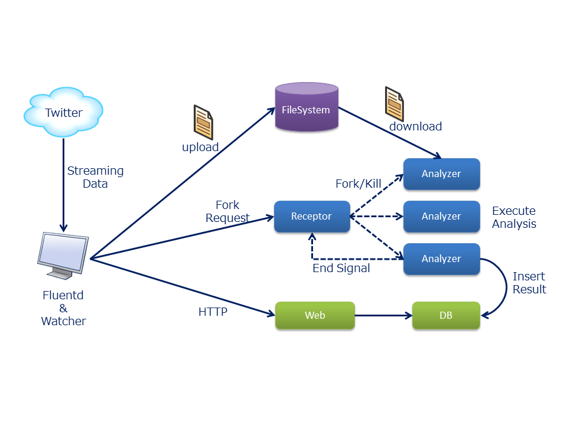

# Twitter Positive / Negative Analyzer (Sample RACK application)

## Overview

This is a tweet analysis application utilizing RACK.
You can analyze big streaming data from Twitter quickly by making use of cloud power.

The purpose of this application is knowing that people are positive or negative about a certain word.
When streaming data including a certain word is put into analyzer, it gives a score.
The score ranges from -1 to 1, and the closer to 1, the more positive it is.
We use [TreeTagger](http://www.cis.uni-muenchen.de/~schmid/tools/TreeTagger/) and
[Semantic Orientations of Words](http://www.lr.pi.titech.ac.jp/~takamura/pndic_en.html) in the analyzer.
You can see the score via a simple web application.

The processing flow is described below.

* Fluentd, an open source data collector, collects streaming data from Twitter and writes it to a file periodically.
* When a watcher process detects creation of a new file, it uploads the file to `File System` provided by RACK.
* In addition, the watcher process requests receptor process to do `Fork`.
* The receptor process forks and then analyzer process will be launched.
  A parent child relationship will be created at that time.
* The analyzer process downloads the data file from `File System` and executes analysis.
* Finally, the analyzer process inserts the result score into database, and then you can see the score via web application.

Note that when the analyzer process finishes its job, it sends a signal (actually this is a simple text message) to 
its parent (the receptor process) via IPC provided by RACK, and then the parent `Kill`s the child.

Fluentd, watcher process and receptor process are all in one process (VM) in the following.




## Execution Procedure

Now let's try to deploy this application on your environment.

### Building Binary (Glance Image)

We provide imagebuild.sh to build a binary easily.
We assume that you have registered a Glance image of CentOS6.5.

First, launch a VM from CentOS6.5 image and log in to it as root user.
Then you just install git by yum command.

```
# yum install -y git
```

Next, clone RACK repository.

```
# git clone https://github.com/stackforge/rack.git
```

This application needs to connect to Twitter API, so you have to give API Key, Auth Token, etc.
Refer to [Twitter Developers](https://dev.twitter.com/) to get them.
Fill in the following variables in `imagebuild.sh`.

* API_KEY
* API_SECRET 
* ACCESS_TOKEN
* ACCESS_TOKEN_SECRET
* KEYWORDS: Collect tweets including this keywords. You can specify some keywords in format of comma separated value.

Now execute `imagebuild.sh`.

```
# cd rack/tools/sample-apps/tweet-analyzer
# ./imagebuild.sh
```

When it finished, shutdown the VM and save snapshot.

### Deploy RACK Proxy

Before deploying our application, you have to deploy RACK Proxy.
It's easy because we provide a useful shell `rack-client` to deploy Proxy automatically.
We assume that RACK API is ready for access.
Refer to [How to work RACK](https://github.com/stackforge/rack/tree/master/tools/setup) to deploy RACK API.

Now let's log in to RACK API and create `group-init.conf` that is a configuration file of `rack-client` shell like below.
Fill in the blanks according to your environment.

**group-init.conf**
```
[group]
# Any group name you like
name =

[keypair]
is_default = True

[network]
# Network that Proxy connects to. Write with format like "10.0.0.0/24"
cidr =
# Router ID that is ID of a router connecting to public network
ext_router_id =
# IP addresses of valid DNS servers. Write with space separated value like "8.8.8.8 4.4.4.4"
dns_nameservers =

[securitygroup]
securitygrouprules = 
    protocol=tcp,port_range_max=8088,port_range_min=8088,remote_ip_prefix=0.0.0.0/0
    protocol=tcp,port_range_max=22,port_range_min=22,remote_ip_prefix=0.0.0.0/0
    protocol=tcp,port_range_max=80,port_range_min=80,remote_ip_prefix=0.0.0.0/0
    protocol=tcp,port_range_max=8080,port_range_min=8080,remote_ip_prefix=0.0.0.0/0
    protocol=tcp,port_range_max=8888,port_range_min=8888,remote_ip_prefix=0.0.0.0/0
    protocol=tcp,port_range_max=5432,port_range_min=5432,remote_ip_prefix=0.0.0.0/0
is_default = True

[proxy]
# Nova flavor ID
nova_flavor_id =
# Glance image ID of the rack image
glance_image_id =
```

Then execute the following command.

Note that variables, OS_USERNAME and OS_TENANT_NAME, will be registered on RACK database as someone who executed command.
It's not related to OpenStack username and tenant name.
Here you don't need to care and execute it as it is.


```
# export OS_USERNAME=demo_user
# export OS_TENANT_NAME=demo_tenant
# rack_client group-init --config-file /path/to/group-init.conf
gid: 8612d17d-737e-4050-be93-cd49b1574e1e
keypair_id: da6bde2d-1753-410a-9f2a-3a99c88584f6
securitygroup_id: 1cd37c45-f38e-4407-9bd6-cb2222ad928d
network: 8c627394-e4cd-4c9e-972c-fad704323966
pid: f08d3e1b-5b51-4fd6-849a-5b7983f35c0d
```

Note values above and give it to the following commands as option.

Now you can see that a new VM has launched on your OpenStack environment.
Check if Proxy is deployed successfully by executing the following command.

```
# rack_client --url http://{proxy's IP address}:8088/v1/ proxy-show --gid 8612d17d-737e-4050-be93-cd49b1574e1e
{"proxy": {"status": "ACTIVE", "userdata": null, "ppid": null, "user_id": "demo_user","name": "pro-f08d3e1b-5b51-4fd6-849a-5b7983f35c0d", "ipc_endpoint": {"host": "10.0.50.2", "port": "8888"}, "app_status": "ACTIVE", "pid": "f08d3e1b-5b51-4fd6-849a-5b7983f35c0d", "args": {"roles": "ipc/shm/api/proxy"}, "fs_endpoint": null, "gid": "8612d17d-737e-4050-be93-cd49b1574e1e", "keypair_id": "da6bde2d-1753-410a-9f2a-3a99c88584f6", "nova_flavor_id": 3, "shm_endpoint":{"host": "10.0.50.2", "port": "6379"}, "project_id": "demo_user", "glance_image_id": "1725f6c0-264a-4202-8886-7998dfe4457b"}}
```

It's okay if you get JSON response like above.

Application uses `File System` and `IPC` so you have to register endpoints of these.
Proxy provides `IPC` by default, but it makes use of Swift (Object Strage) on your OpenStack as `File System`,
so you need to give your OpenStack authentication credentials.
Please resister your credentials to Proxy by executing the following commands.

```
# OS_USERNAME={openstack username}
# OS_PASSWORD={openstack password}
# OS_TENANT_NAME={openstack tenant name}
# OS_AUTH_URL={openstack keystone endpoint}
# rack_client --url http://{proxy's IP address}:8088/v1/ proxy-update --gid 8612d17d-737e-4050-be93-cd49b1574e1e \
  --fs_endpoint {\"os_username\":\"$OS_USERNAME\"\,\"os_password\":\"$OS_PASSWORD\"\,\"os_tenant_name\":\"$OS_TENANT_NAME\"\,\"os_auth_url\":\"$OS_AUTH_URL\"} --app_status ACTIVE
```

And you also need to create a Swift container with the name of `gid` value,
actually, you should create a container named "8612d17d-737e-4050-be93-cd49b1574e1e" that is `gid` you got above.

### Deploy Application

It's easy to deploy our application because the application binary has setup to deploy itself when it is launched.
What you need to do is just executing the following command.

```
# rack_client --url http://{proxy's IP address}:8088/v1/ process-create --gid 8612d17d-737e-4050-be93-cd49b1574e1e \
  --keypair_id da6bde2d-1753-410a-9f2a-3a99c88584f6 --securitygroup_ids 1cd37c45-f38e-4407-9bd6-cb2222ad928d \
  --nova_flavor_id {Flavor ID} --glance_image_id {Glance image ID of the binary} --name parent
```

Now a new process (VM) named `parent` is launched and the application is running.
You can log in to `parent` and issue the command `screen -r` to see how it works.
There are 3 windows in the screen, receptor, viewer (web application) and watcher,
and you can see log output in each window.

### Browse Result Of Analysis

Web application in `parent` provides a simple web interface to see the result of analysis.
Browse `http://{parent's IP address}` and you will see a simple form interface.

