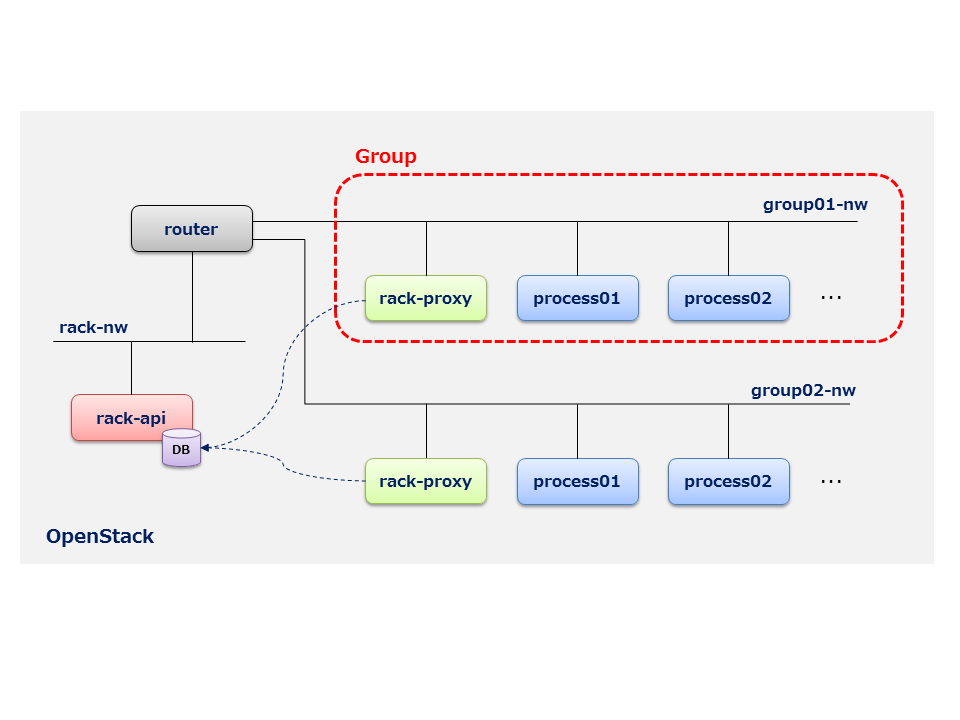

# How to deploy RACK

This chapter describes how to deploy RACK.

If you don't have an OpenStack environment or just want to test RACK, please refer to [Test RACK with devstack](#procedure2).

## Deploy steps

### 1. Prerequisites

`Icehouse` version is intended.

Following OpenStack services must be online for RACK to work properly. Any backend can be used for each OpenStack service and only APIs are required.

| Service  | API version |
| -------- |:-----------:|
| Nova     | v2          |
| Neutron  | v2          |
| Glance   | v1          |
| Keystone | v2.0        |
| Swift    | v1          |

Glance image of `CentOS-6.5` is required, too.


### 2. Architecture

RACK is composed of two main roles, `rack-api` and `rack-proxy`. A `rack-proxy` runs in each process group and share database which `rack-api` holds.
`rack-api` and `rack-proxy` run as virtual instances.




### 3. Desploy steps

#### 3.1. Create a snapshot for RACK

`rack-api` and `rack-proxy` shares the same image. You can choose a role by changing boot condition. This section describes how to make an image(actually a snapshot) out of `CentOS-6.5` based image and register it.

First, boot a VM with Horizon or Nova CLI from `CentOS-6.5` based Glance image. This VM must be able to connect to the Internet.

Secondly, login to this VM as root and run following commands.
During this series of command, `imagebuild.sh` script installs required packages and configure it for `rack-api`.

```
# git clone https://github.com/stackforge/rack
# cd rack/tools/setup
# ./imagebuild.sh
Start RACK image building...
...

****************************************
Finish RACK image building.
Shutdown and save snapshot of this instance via Horizon or glance command.
****************************************
```

Above message indicates the installation is complete. 

At last, shutdown VM and create a **Instance Snapshot**.


Following message indicates the installation is not complete. Please resolve issue and run `imagebuild.sh` again.

```
****************************************
Error occurred. Execution aborted.
Error: Installing the required packages
****************************************
```


#### 3.2. Create a virtual network

We will create a virtual network for `rack-api` VM.
Please create a virtual network which satisfies following conditions.

- attached to a virtual router which connects to the Internet


#### 3.3. Create a security group

`rack-api` VM uses following ports.
Please create a security group which permits them from Horizon or Neutron CLI.


| Port  | Service           |
|:-----:| ----------------- |
| 8088  | API Service       |
| 3306  | MySQL Service     |


#### 3.4. boot `rack-api` VM

Boot a `rack-api` VM with following command from Nova CLI.

Please note that OpenStack authentication info fed as meta-data will be written to the configuration file inside `rack-api` VM.


```
# nova boot ¥
  --flavor { any flavor with more than 2GB RAM } ¥
  --image { snapshot created at step #3.1 } ¥
  --nic net-id={ virtual network created at step #3.2 } ¥
  --meta os_username={Keystone username} ¥
  --meta os_password={Keystone password} ¥
  --meta os_tenant_name={Keystone tenant name} ¥
  --meta os_auth_url={Keystone API URL} ¥
  rack-api
```

You can check whether `rack-api` service runs correctly with `RACK CLI`.
Please refer to how to install `RACK CLI` [**here**](https://github.com/stackforge/python-rackclient).

```
$ export RACK_URL=http://{IP address of rack-api VM}:8088/v1
$ rack group-list
+-----+------+-------------+--------+
| gid | name | description | status |
+-----+------+-------------+--------+
|     |      |             |        |
+-----+------+-------------+--------+
```


## <a name="procedure2">Test RACK with devstack</a>

**to be continued**